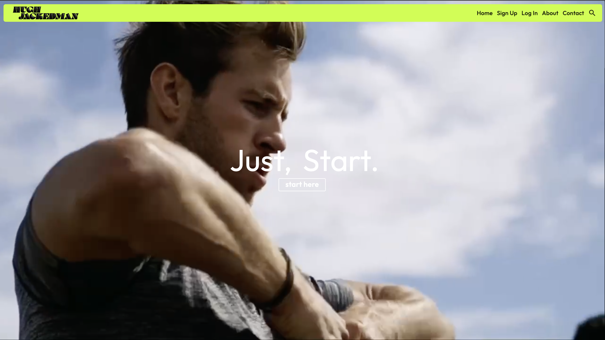

# Celebrity Health & Fitness App

A platform that empowers a Celebrity/Fitness Personality to generate revenue by distributing their brand specific workout videos using a Subscription-Pricing Model. The videos can be hosted on any Cloud platform easily accessible throughout the globe. 

## Built with
      

## Contents:
   - [Home](#Home-Page)
   - [Sign-Up Form](#Sign-Up-Page)
   - [Content](#Content-Page)
   - [Store](#Store-Page)
   - [Cart](#Cart-Page)
   - [About](#About-Page)
   - [Contact Us](#Contact-Us-Page)
   - [404/Not Found Page](#Not-Found-Page)

## Home Page:

The page is divided into banners, each banner with specific intent showcasing the features of the app. 

### Motivation:

### Fresh Weekly Recipes To Keep Workouts Going:

### New Celebrity Workouts, Posted Weekly and Live One-On-Ones For Highest Tier Members:

### A Carousel Showcasing Current And Past Members' 'Success Stories' Using The App:

## Sign-Up Page:
The Signup form here is an Angular multi-page form that can be broken down into three main parts:

### Part I The Progress Tracker: 
Located on the left of the form, keeps track of the current step in the form.

### Part II The Next and Back Buttons: 
The next and back buttons are enabled only when the inputs are filled and each filled to specifications unique to each input and when the requirements are fulfilled, the Next button is enabled. 

### Part III The Form Itself:
The form is divided into 5 steps, each step being its very own Angular Component which is navigated to with the afore mentioned Next & Confirm buttons, the current step is maintained using observables in the form.service.ts file.

### Form Step 1: Personal Info Page
The inputs have a level error checking, errors messages are triggered when an error requirement is met. 
The Password Field of the Personal Info page of the form has a level of password mismatch checking. *More work needs to be done here to cover all edge cases.
 
 

 

 

### Form Step 2: Plan Details Page
The plans are laid out here for the prospective customer to make a choice.
 
 

 
The toggle switches the price from Monthly to Yearly billing and offers the client a promo (2 months free). The choices are retained in the UI in case the customer decides to change the selected plan after going to the next page. 

 

### Form Step 3: Summary Page
This step offers the customer a summary of what they will be paying monthly/yearly. 
 
 

 

### Form Step 4: Payment Page
This is where the client inputs their card info so the subscription billing can begin. Here we are storing the card information as an example, but in production we will be using the Stripe JS to mount a customizable Credit Card Form directly into this page for seamless and secure payments. This page also has validation for each input and will throw errors similar to Step 1 of the form.
 
 

 

### Form Step 5: Confirmation Page
Here we have the confirmation messsage displayed with support contact info and will automatically route to the login page just as the customer finishes reading the text. 
 
 

## Sign-Up Form Responsive:
 
### Personal Info Page Responsive
 

 
### Plan Details Page Responsive
 

 
### Summary Page Responsive
 

 
### Payment Page Responsive
 

 
### Confirmation Page Responsive
 

 

The Billing Frequency Toggle in the Plan Details Page changes the information seen on each plan and adjusts pricing accordingly providing an attractive promo. 
Each page of the form forms its own Component in Angular. The toggle in the plan

# Backend
The Backend for Celebrity Health & Fitness App was developed using MVC based Node.js and Express.js, utilizing Sequalize. With a RESTful API that can scale based on demands reliably; with MySQL as the database.

## Backend: https://github.com/goodonone/celebrity-health-fitness-video-subscription-backend-nodejs
